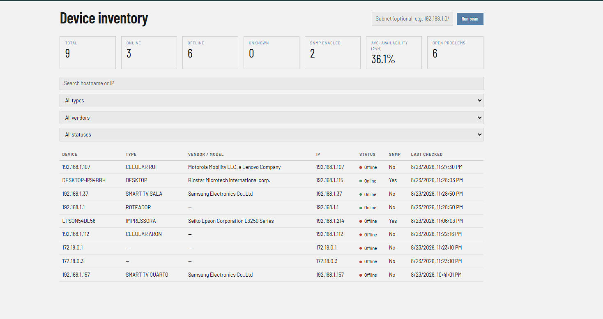
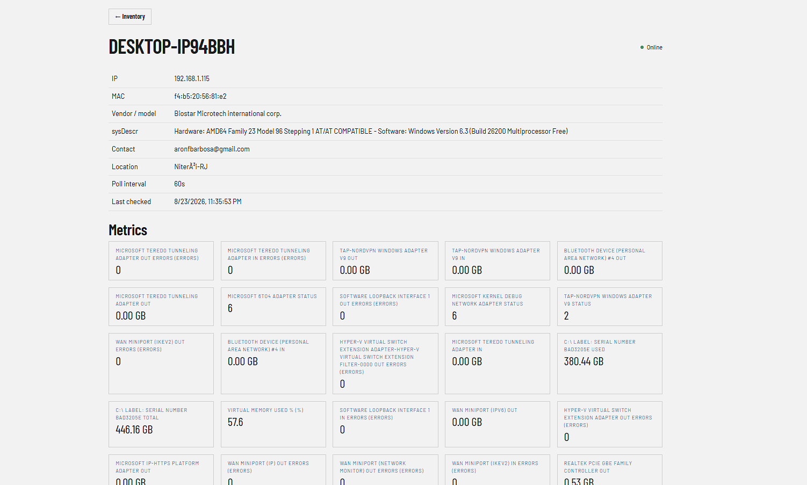

# Monitoramento de Equipamentos via SNMP


Aplicação full-stack que **descobre equipamentos numa rede local (ARP)**,
**identifica e coleta métricas via SNMP**, e acompanha **disponibilidade**
(online/offline, downtime, MTTR) com um dashboard de indicadores — do zero,
sem mocks nos testes de integração e sem dependências pesadas de
agendamento (nada de APScheduler: só `asyncio` puro).

Monorepo: [`backend/`](backend/README.md) (FastAPI + SQLAlchemy + pandas) e
[`frontend/`](frontend/README.md) (React + TypeScript + Vite).

---

## Screenshots

| Inventário de devices | Detalhe do device |
|---|---|
|  |  |

---

## Arquitetura & Fluxo de Dados


```
IPSCAN (ARP/scapy) → SNMPSCAN (identidade) → polling periódico (métricas +
disponibilidade) → Postgres (Supabase) → camada de ETL (pandas) → API REST
(FastAPI) → SPA React
```

O diagrama acima ([fonte editável em `docs/architecture.excalidraw`](docs/architecture.excalidraw))
percorre o pipeline completo, seção por seção — da varredura ARP com fallback
por ICMP, passando pelo loop de polling em `asyncio` com backoff, o esquema
de dados no Postgres, as fórmulas da camada de ETL, os endpoints reais da API
e as duas telas do frontend, até o deploy via Docker Compose.

- **Backend**: Clean Architecture em camadas (`models` → `repositories` →
  `services` → `composer`), sem Alembic (`create_all` idempotente) e sem
  APScheduler (loop `asyncio` simples). Banco padrão é Postgres via Supabase,
  tanto local quanto em Docker. Detalhes em [`backend/README.md`](backend/README.md).
- **Frontend**: SPA (React Router + TanStack Query), duas telas — inventário
  com KPIs/filtros/scan e detalhe do device com métricas e disponibilidade.
  Detalhes em [`frontend/README.md`](frontend/README.md).

---

## Destaques de engenharia

- **Descoberta resiliente**: varredura ARP (camada 2, `scapy`) com fallback
  automático para ping sweep (ICMP, camada 3) quando o ambiente não tem
  acesso à LAN física — como dentro do Docker Desktop. O resultado do scan
  sinaliza explicitamente `used_ping_sweep_fallback`.
- **Polling com backoff**: cada device tem seu próprio `next_poll_at`; falhas
  consecutivas espaçam o próximo poll, sucessos aceleram — sem depender de
  APScheduler ou Celery, só um loop `asyncio` (`run_forever()`).
- **Disponibilidade calculada, não armazenada**: `AvailabilityEvent` guarda
  só as transições online/offline; uptime %, downtime e MTTR são derivados
  sob demanda por uma camada de ETL em `pandas`.
- **Rollup estilo Zabbix**: um segundo loop, com cadência bem mais longa,
  agrega `metric_history` em `metric_trends` (history/trends/housekeeper).
- **Testes de integração reais, sem mocks**: a suíte fala com Postgres e rede
  de verdade — pacotes ICMP/SNMP reais trafegam nos testes. A única exceção
  é a rota de scan (lenta/flaky por natureza), que troca a dependency via
  `app.dependency_overrides`.
- **Frontend que não trava sem backend**: cada tela renderiza seu shell
  imediatamente mesmo com a API fora do ar, com banners de erro e retry
  manual, e um `ErrorBoundary` global contra falhas de renderização.
- **Metrics dinâmicas**: métricas cuja chave só existe em runtime (ex: um SNMP
  walk sobre uma tabela) são descobertas e persistidas sem precisar de
  migração — `MetricDefinition` é criada sob demanda.

---

## Como rodar (Docker — recomendado)

```bash
cp backend/.env.example backend/.env   # preencha DATABASE_URL (Supabase)
docker compose up --build
```

Sobe dois serviços: `app` (API FastAPI em `http://localhost:8000`) e
`frontend` (build de produção servido por nginx em `http://localhost:8080`,
com `/api/*` proxeado pro `app` — mesmo papel do proxy do Vite em dev, sem
precisar configurar CORS). Abra `http://localhost:8080`.

> A descoberta de rede (ARP) não funciona de dentro do container Docker
> Desktop (Windows/Mac) — rode o scan direto no host quando precisar
> descobrir devices novos (ver
> [`backend/README.md`](backend/README.md#rodando-via-docker)). O
> polling/coleta de métricas via SNMP roda normalmente dentro do container,
> e `GET /network/ping-sweep?subnet=<sua-lan>` dá uma varredura ICMP (quem
> está de pé na rede) que funciona de dentro do container mesmo sem ARP.

Para desenvolver o frontend com hot-reload em vez do build estático do
container, use o Vite direto:

```bash
cd frontend
npm install
cp .env.example .env
npm run dev                            # http://localhost:5173
```

## Rodando localmente sem Docker

Ver os READMEs de cada parte: [`backend/README.md`](backend/README.md#rodando-localmente)
e [`frontend/README.md`](frontend/README.md#rodando-localmente-backend--frontend).

## Testes

```bash
docker compose -f docker-compose.test.yml up -d --wait   # Postgres descartável
cd backend && uv run pytest -q
```

Suíte fala com rede/banco reais (sem mock), exceto a rota `POST
/devices/scan`, que troca a dependency real de scan via
`app.dependency_overrides`. Dois testes que dependem de um device SNMP real
na LAN ficam `skip` sem `SNMP_TEST_TARGET` configurado — ver
[`backend/README.md`](backend/README.md#rodando-os-testes).

---

## Funcionalidades

- Descoberta de equipamentos na rede (ARP) e identificação via SNMP; varredura
  ICMP (`GET /network/ping-sweep`) como alternativa de diagnóstico em
  ambientes sem acesso L2 à LAN (ex: dentro de container).
- Polling periódico com backoff e histórico de métricas por device.
- Disponibilidade (eventos online/offline) com % de uptime, downtime e MTTR.
- Dashboard com indicadores agregados (`GET /dashboard/summary`) e por device
  (`GET /devices/{id}/availability`).
- Frontend resiliente: cada tela renderiza seu shell (header, filtros, botão
  de voltar) imediatamente, mesmo com o backend fora do ar, com banners de
  erro e retry manual, e um `ErrorBoundary` global contra falhas inesperadas
  de renderização.

## Stack técnica

| Camada | Tecnologias |
|---|---|
| **Backend** | Python 3.11+, FastAPI, SQLAlchemy 2.0, pandas, `pysnmp`, `scapy`, `psycopg3`, `pytest` |
| **Frontend** | React 18, TypeScript, Vite, React Router, TanStack Query |
| **Banco** | PostgreSQL gerenciado (Supabase), local e em Docker |
| **Infra** | Docker Compose (`app` + `frontend`/nginx), sem Alembic, sem APScheduler |

## Estrutura do repositório

```
.
├── backend/     # API FastAPI, ETL, coleta SNMP/ARP — ver backend/README.md
├── frontend/    # SPA React (Vite) — ver frontend/README.md
├── docs/        # Diagrama de arquitetura (.excalidraw + .png) e screenshots
└── docker-compose.yml
```
